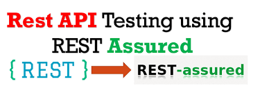
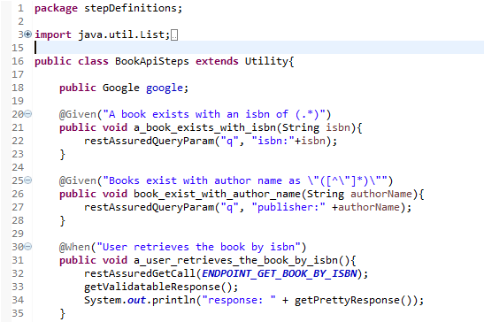
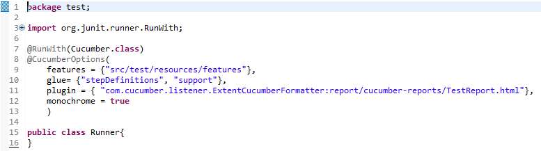
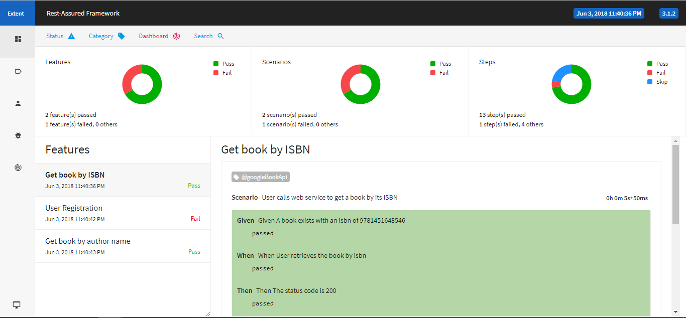

   <i><strong>This project demonstrates the basic webservice & api testing project setup with restassured.
</strong></i>

### RestAssured Framework Setup Guide

### Getting started with API and RestAssured
Please do checkout a youtube video which would give you more insight on API [Rest API](https://www.youtube.com/watch?v=qVTAB8Z2VmA). And follow the blogpost [Rest Assured](https://techbeacon.com/how-perform-api-testing-rest-assured) to get started with rest assured.

### Features
* Well structured project built with maven.
* BDD feature makes business person to understand and write test cases.
* Utility class provides rich set of methods that can be used directly in step definitions.
* Able to create java object with POJO class.
* Extensive hooks implemented for Before and After scenario etc.
* Excellent reporting feature with Cucumber-Extent report.

### Getting started with project setup

### Pre-requisite
1. Maven should be installed in the system.
2. Editor(optional) installed -> Eclipse.

### Setup scripts
* Clone the repository into a folder.
* Open the folder in any editor like Eclipse.
* Save the project it will download all the dependencies if not already present in the system.

### Run scripts
* Go to the Runner class inside folder src/test/java/test.
* Include all the feature files which you want to run.
* Right click when opened in eclipse and run as JUnit Test.

### Build project with maven
* Project can be compiled and run with maven command - <b>mvn test</b>
* And can be packaged into jar file - <b>mvn package</b>
  
#### Writing Features

#### Writing Step Definitions

#### Runner Class

#### Cucumber-Extent Report
Currently this project has been implemented with [cucumber-extent-reporter](https://github.com/email2vimalraj/CucumberExtentReporter), which is generated in report folder when you run the JUnit test from Runner.java file. They can be customized according to user's specific needs.

